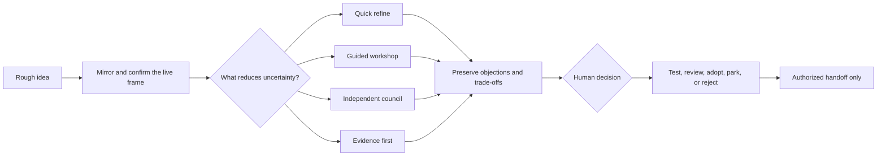

# Idea Council — Challenge and Refine Ideas

[Website](https://fanfanfanfanfan626.github.io/challenge-and-refine-ideas/) · [简体中文](README.zh-CN.md) · [AI installation guide](AI_INSTALL.md) · [Examples](EXAMPLES.md) · [Compatibility](COMPATIBILITY.md) · [Download v2.0.1 ZIP](dist/challenge-and-refine-ideas-v2.0.1.zip) · [Changelog](CHANGELOG.md)

[](https://github.com/fanfanfanfanfan626/challenge-and-refine-ideas/releases)
[](https://github.com/fanfanfanfanfan626/challenge-and-refine-ideas/actions/workflows/validate.yml)

`challenge-and-refine-ideas` is an agent skill for exploring, refining, comparing, challenging, and deciding on early ideas before implementation. One facilitator stays accountable to the user while the system selects the lightest useful set of reasoning lenses or isolated advisers.

It is designed for Codex and can be adapted to other agent hosts that support local skills and, for independent councils, clean subagent contexts. Package compatibility is not a claim of verified live-host behavior; see [COMPATIBILITY.md](COMPATIBILITY.md).

## What makes it different

- It confirms the working problem frame before an expensive council discusses it.
- Exploration may remain exploratory; it is not forced into a recommendation.
- The red team must attack the latest candidate, not an abandoned earlier draft.
- Adviser independence and external evidence are reported on separate axes.
- Every material objection receives a stable ID and a canonical disposition.
- Decision-changing evidence is gathered before more opinions when facts are the bottleneck.
- High-stakes claims cannot become consequential execution merely through agent agreement.
- Execution requires both evidence sufficient for the exact scope and explicit human authorization.



## Five session intents

| Intent | Purpose |
| --- | --- |
| `explore` | Open possibilities and discover meaning without forced convergence |
| `refine` | Improve the current idea and fill consequential gaps |
| `compare` | Contrast real alternatives against human-owned criteria |
| `challenge` | Steelman the current candidate, then try to reject or reshape it |
| `decide` | Make the choice, dissent, evidence sufficiency, and next commitment explicit |

The facilitator routes each session through `quick-refine`, `guided-workshop`, `independent-council`, `evidence-first`, or `decision-review`. It does not ask the user to choose agent count, topology, or model budget.

## Honest independence and evidence

These are deliberately separate:

| Adviser independence | Meaning |
| --- | --- |
| `L0` serial lens | One context applies several perspectives; useful but correlated |
| `L1` isolated memo | A separate adviser receives only a bounded packet and no inherited opinions |
| `L2` blind challenge | A neutral current candidate is challenged without facilitator advocacy |

External grounding is reported independently as `none`, `primary-source`, `field`, `experimental`, or `operational`. Multiple agents agreeing is never labeled as market, legal, medical, technical, or user evidence.

## Three-axis state model

The durable Idea Charter does not collapse different questions into one status:

```text
maturity: raw → framed → expanded → challenged → decision-ready
evidence_state: discussion-useful | test-needed | review-needed | sufficient-for-scope
human_disposition: undecided | adopted | parked | rejected
```

This can represent an idea that is thoroughly challenged and directionally adopted while still blocked on legal, safety, consent, or professional review.

## Install in Codex

The installable package is [`skill/challenge-and-refine-ideas`](skill/challenge-and-refine-ideas). Repository documentation and release tooling are intentionally kept outside the skill itself.

### Windows PowerShell

```powershell
git clone https://github.com/fanfanfanfanfan626/challenge-and-refine-ideas.git
$destination = Join-Path $env:USERPROFILE ".codex\skills\challenge-and-refine-ideas"
New-Item -ItemType Directory -Force (Split-Path $destination) | Out-Null
Copy-Item ".\challenge-and-refine-ideas\skill\challenge-and-refine-ideas" $destination -Recurse
```

### macOS or Linux

```bash
git clone https://github.com/fanfanfanfanfan626/challenge-and-refine-ideas.git
mkdir -p ~/.codex/skills
cp -R challenge-and-refine-ideas/skill/challenge-and-refine-ideas ~/.codex/skills/challenge-and-refine-ideas
```

Restart Codex, then try:

```text
Use $challenge-and-refine-ideas to explore this idea without forcing a decision yet. Surface materially different interpretations and ask the question that would most change the direction.
```

An audited standalone package is also available at [`dist/challenge-and-refine-ideas-v2.0.1.zip`](dist/challenge-and-refine-ideas-v2.0.1.zip). It includes the package's MIT license.

```text
SHA-256: 7B8B69F30513D2E8E9F697616D161A55F5E3B8A6C7E0FBFE7AA417EDF6A45AF6
```

For installation by another AI agent, use [AI_INSTALL.md](AI_INSTALL.md).

## Package contents

| Path | Purpose |
| --- | --- |
| `SKILL.md` | Discussion contract, routing, council protocol, gates, and handoff rules |
| `references/discussion-methods.md` | Framing, expansion, challenge, and convergence methods |
| `references/perspective-lenses.md` | Lens selection, independence levels, and adviser packet quality |
| `references/evidence-grounding.md` | Decision-changing claim research and evidence thresholds |
| `references/idea-charter.md` | State transitions, dissent preservation, versioning, and handoff |
| `assets/idea-charter.template.md` | Canonical durable Idea Charter template |
| `agents/openai.yaml` | Codex-facing display metadata and invocation prompt |

## Boundaries

- The skill improves and stress-tests intent; it does not implement an idea without a separate explicit request.
- It never creates or overwrites an Idea Charter file without user approval and an agreed path.
- It does not simulate a large board, vote ideas into truth, or hide dissent behind consensus language.
- Agent councils do not replace real users, experiments, market evidence, qualified professionals, consent, or legal authority.
- When clean context isolation is unavailable, the result must be labeled `L0` even if several agent names were involved.

For copy-paste explore, compare, challenge, and high-stakes scenarios, see [EXAMPLES.md](EXAMPLES.md).

## Validate a checkout

```bash
python -m pip install -r requirements-dev.txt
python tools/validate_release.py
```

The release validator checks package structure, frontmatter, metadata, linked references, protocol invariants, local-path and secret leakage, ZIP contents, and the published SHA-256. GitHub Actions runs it on every push and pull request.

## License

MIT. See [LICENSE](LICENSE).

Questions and contribution standards are documented in [SUPPORT.md](SUPPORT.md), [CONTRIBUTING.md](CONTRIBUTING.md), and [CODE_OF_CONDUCT.md](CODE_OF_CONDUCT.md). Report sensitive problems through [SECURITY.md](SECURITY.md), not a public Issue.

## Related projects

- [Mastery Tutor](https://github.com/fanfanfanfanfan626/mastery-tutor) turns compatible AI agents into local-first mastery tutors.
- [Persistent AI Studio](https://github.com/fanfanfanfanfan626/orchestrate-agent-organization) carries authorized product work from discovery into delivery and long-term stewardship.
- [Skill Governor](https://github.com/fanfanfanfanfan626/skill-governor) audits and maintains overlapping Agent Skill libraries.
